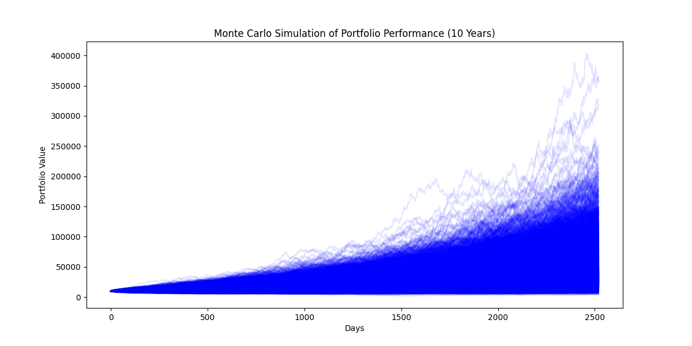

# MSDS 460 Assignment 4
MSDS 460 Work Group Assignment 4  
Jake Baker, Eve Huang, Hamdi Kucukengin, Sally Lee, and Maddy Lok

This repository consists of the work for Assignment 4. In this assignment, we are implementing the method of Monte Carlo simulations to make recommendations for investment portfolio selection and management.  

## Table of Contents
- [Introduction](#introduction)
- [Data Sources](#data-sources)
- [Specification](#specification)
- [Methods](#methods)
- [Results](#results)
- [Discussion](#discussion)

## Introduction

An exchange-traded fund, or ETF, is a type of fund that is traded on exchanges. By investing in an ETF, you are given the flexibiility of trading during market hours, typically with lower fees. It also comes with lower risk, and increases diversity within a portfolio. We designed and evaluated an actively managed ETF that is centered around **lifestyle, food, and consumer based companies**.  

The goal of this project is to utilize Monte Carlo methods in order to simulate various market conditions to measure the long term performance of a diversified portfolio that maintains a balance of growth and stability while mitigating risks as much as possible.

## Data Sources  

Stock price data from 1999 to 2024 was collected utilizing the [Yahoo Finance API](https://pypi.org/project/yfinance/), with the yfinance package in Python. The dataset consists of a broad selection of consumer-based companies including retail, healthcare, food and beverage, and lifestyle companies, including Coca-Cola, Costco, General Mills, Johnson & Johnson, and Nike. We can use this dataset to identify investment patterns and simulate future market scenarios to test the longevity of our ETF. Our dataset was screened to retrieve the key fundamental statistics including values such as market cap, debt/equity, revenue growth, payout ratio, etc. These were then converted and saved into a separate dataframe to be utilized in our [portfolio analysis](mcap_weighted_portfolio.py).  

The data was adjusted to ensure the index was in date-time format. Additionally, the monthly log returns was calculated to reduce noise in daily price fluctuations, making it easier to identify trends. It allows for analysis of broader market activity rather than measuring short-term volatiliy. 

## Methods

The Python code for the [initial EDA](stock_data_EDA.py) has been provided with annotations. The program was written in Python utilizing matplotlib and seaborn to create the initial plots to summarize the initial data. After screening our dataset for key metrics, this new cleaned dataset was utilized to analyze our portfolio. In this code, we were able to retrieve dividend data and yield to compute equal-weighted portfolio returns. These returns were then utilized for Monte Carlo simulation. Additionally, we retrieved S&P 500 (SPY) for comparison to our portfolio.  

Our [Monte Carlo](monte_carlo_simulation.py) simulation was created to generate 1000 potential future situations based on historical trends and volatility. This allows for the evaluation of the resilience of our portfolio across different market conditions. We set the simulation to simulate 10 years of daily returns with our portfolio value starting at 1000.  

## Results

This portfolio's growth performance is significantly higher than the standard S&P 500, especially towards later years in which it accelerates rapidly. In terms of volatility, investing in lifestyle and consumer-based stocks is a strong long-term investement, as these types of stocks remaind relatively stable as they are rarely replaced or affected by changes such as technological advancements.  

While this ETF offers strong long-term returns, there are some concerns regarding maintenance stability, as the management fee is quite low which would not allow for much funding in regards to staff and technology. However, the ETF shows a strong potential for returns. If the management fee were to be increased even slightly, the firm could be very strong.

### Plot of stock price trends from 1999-2024:  

  

### Rolling volatility:  
  

### Plot of Our Portfolio vs S&P 500 Performance:  

  

### Monte Carlo Simulation:  

